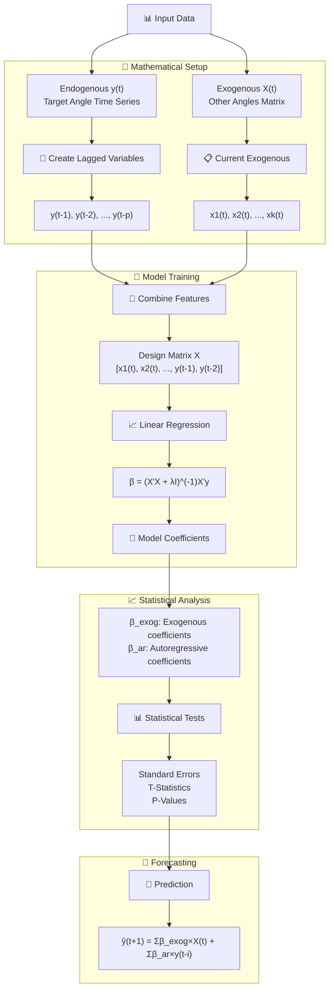
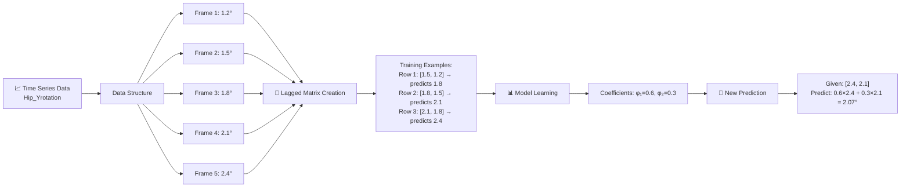
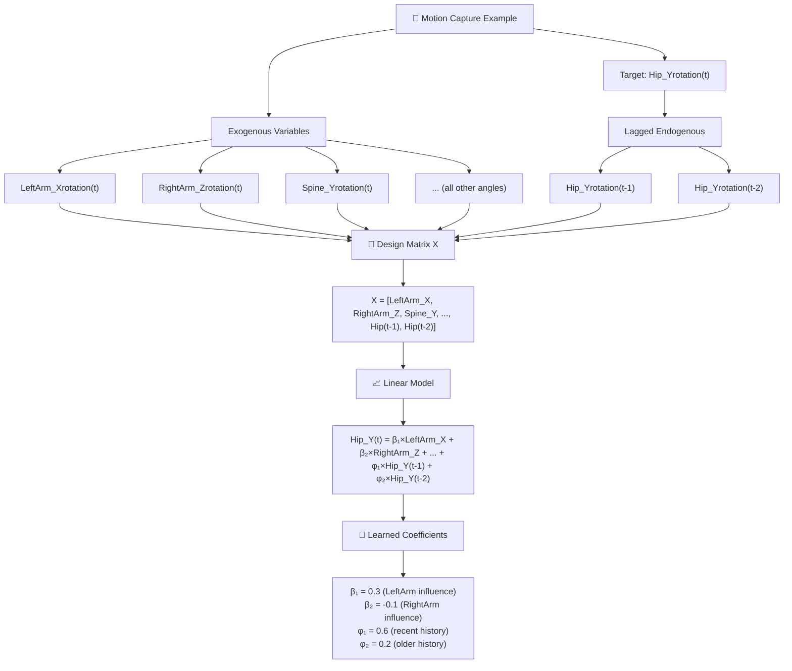
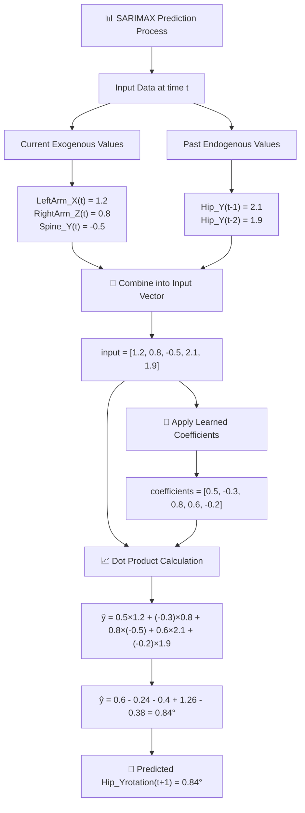

# 🧠 SARIMAX Model Diagrams & Visualizations

This document contains visual representations of the SARIMAX model structure, workflow, and prediction process used in the motion capture analysis application.

---

## 📊 **Diagram 1: Complete SARIMAX Model Structure**

This diagram shows the full mathematical workflow from input data through training to prediction.



**Key Features:**
- **Mathematical Setup**: Data preparation and feature engineering
- **Model Training**: Linear regression with regularization
- **Statistical Analysis**: Coefficient significance testing
- **Forecasting**: Prediction generation

---

## 📈 **Diagram 2: Time Series Lagged Matrix Example**

This demonstrates how lagged variables are created from a concrete time series.



**Example Process:**
- **Input**: Time series of Hip Y-rotation angles
- **Lagged Matrix**: Create training pairs using sliding window
- **Learning**: Find optimal coefficients for past values
- **Prediction**: Apply learned pattern to new data

---

## 🎯 **Diagram 3: Motion Capture Context**

This shows how SARIMAX applies specifically to motion capture data.



**Motion Capture Insights:**
- **Target Joint**: Hip Y-rotation as the variable to predict
- **Body Coordination**: Arms and spine movements influence hip motion
- **Temporal Memory**: Recent hip positions predict future positions
- **Coefficient Interpretation**: Positive/negative influences quantified

---

## 🔮 **Diagram 4: Step-by-Step Prediction Process**

This walks through an actual numerical prediction calculation.



**Calculation Breakdown:**
- **Exogenous Contribution**: 0.5×1.2 + (-0.3)×0.8 + 0.8×(-0.5) = -0.04°
- **Autoregressive Contribution**: 0.6×2.1 + (-0.2)×1.9 = 0.88°
- **Total Prediction**: -0.04° + 0.88° = 0.84°

---

## 🎯 **Summary of Model Components**

### **Data Structure:**
```
Input Vector = [Exogenous Variables, Lagged Endogenous Variables]
             = [x₁(t), x₂(t), ..., xₖ(t), y(t-1), y(t-2), ..., y(t-p)]
```

### **Model Equation:**
```
y(t) = β₁x₁(t) + β₂x₂(t) + ... + βₖxₖ(t) + φ₁y(t-1) + φ₂y(t-2) + ... + φₚy(t-p) + ε(t)
```

### **Implementation Flow:**
1. **Data Preparation** → Extract target and exogenous variables
2. **Feature Engineering** → Create lagged variables  
3. **Matrix Construction** → Build design matrix X and target vector y
4. **Model Training** → Solve β = (X'X + λI)⁻¹X'y
5. **Statistical Analysis** → Calculate standard errors and p-values
6. **Prediction** → Apply ŷ = X_new × β

### **Key Advantages:**
- **Interpretable**: Linear coefficients show direct relationships
- **Efficient**: Matrix operations enable fast computation
- **Statistical**: P-values indicate variable significance
- **Flexible**: Supports both static and dynamic forecasting
- **Real-time**: Suitable for interactive motion analysis

These diagrams provide a complete visual understanding of how SARIMAX modeling works in the context of motion capture analysis! 🚀 