# 🔄 SARIMAX Analysis Complete Workflow

## 📋 Overview

This document describes the complete workflow from uploading BVH motion capture files to generating SARIMAX time series analysis results in the web application.

## 🎯 Workflow Diagram

```mermaid
graph TD
    A[📁 Upload BVH Files] --> B[🔍 Parse Training File]
    A --> C[🔍 Parse Test File]
    
    B --> D[🏗️ Extract Joints & Channels]
    C --> D
    D --> E[📊 Extract Motion Data]
    E --> F[⚙️ User Configuration]
    
    F --> G[🎯 Define Target Angle]
    G --> H[📋 Prepare SARIMAX Data]
    
    H --> I[🔄 Create Endogenous Data]
    H --> J[🔄 Create Exogenous Data]
    
    I --> K[📊 Normalize Data]
    J --> K
    K --> L[🤖 Create SARIMAX Model]
    
    L --> M[🧠 Train Model]
    M --> N{🔮 Forecasting Method?}
    
    N -->|steps = 1| O[📊 Static Forecasting]
    N -->|steps > 1| P[🔄 Dynamic Forecasting]
    
    O --> Q[📈 Calculate Metrics]
    P --> Q
    Q --> R[📋 Create Model Summary]
    R --> S[🎨 Generate Visualizations]
    S --> T[✅ Display Results]
    
    subgraph "🔧 Data Processing"
        D
        E
        H
        I
        J
    end
    
    subgraph "🧮 Normalization"
        K
    end
    
    subgraph "🤖 Machine Learning"
        L
        M
    end
    
    subgraph "🔮 Prediction"
        N
        O
        P
    end
    
    subgraph "📊 Results"
        Q
        R
        S
        T
    end
```



---

## 📁 **Phase 1: File Upload & Parsing**

### **1.1 User Uploads BVH Files**
```javascript
// Dashboard.jsx - File input handlers
handleTrainFileChange() → uploadTrainFile(file)
handleTestFileChange() → uploadTestFile(file)
```

### **1.2 BVH File Processing**
```javascript
// AppContext.jsx - uploadTrainFile/uploadTestFile
const parser = new BVHParser();
const parsedData = await parser.parseFile(file);
```

### **1.3 BVH Parser Workflow**
```javascript
// bvhParser.js - BVHParser.parseFile()
1. Read file content as text
2. parseBVH(content)
   ├── parseHierarchy() - Extract joints and channels
   │   ├── Find ROOT/JOINT definitions
   │   ├── Extract CHANNELS (Xrotation, Yrotation, Zrotation)
   │   └── Build channels array: ["Hips_Xrotation", "Hips_Yrotation", ...]
   ├── parseMotion() - Extract frame data
   │   ├── Parse "Frames: N" and "Frame Time: X"
   │   └── Convert motion data to numeric arrays
   └── extractEulerAnglesFromMotion() - Organize angle data
```

### **1.4 Parsed Data Structure**
```javascript
{
  joints: ["Hips", "Spine", "LeftArm", ...],
  channels: ["Hips_Xrotation", "Hips_Yrotation", "Hips_Zrotation", ...],
  frameCount: 1000,
  frameTime: 0.01,
  motionData: [[x1, y1, z1, ...], [x2, y2, z2, ...], ...], // Frame data
  eulerAngles: {...},
  availableJoints: [...]
}
```

---

## ⚙️ **Phase 2: Configuration & Analysis Start**

### **2.1 User Configuration**
```javascript
// Dashboard.jsx - User selections
config = {
  targetJoint: "Hips",           // Selected joint
  targetAxis: "Yrotation",       // Selected axis  
  modelParams: {
    lags: 2,                     // AR order
    steps: 1                     // Static (1) or Dynamic (>1)
  }
}
```

### **2.2 Analysis Initiation**
```javascript
// Dashboard.jsx - handleAnalyze()
analyzeData() → AppContext.analyzeData() → SARIMAXAnalyzer.analyze()
```

---

## 🔧 **Phase 3: Data Preparation**

### **3.1 Target Angle Definition**
```javascript
// sarimaxModel.js - analyze()
const targetAngle = `${config.targetJoint}_${config.targetAxis}`;
// Example: "Hips_Yrotation"

const exogAngles = ALL_BVH_ANGLES.filter(angle => angle !== targetAngle);
// All other angles become exogenous variables
```

### **3.2 SARIMAX Data Preparation**
```javascript
// bvhParser.js - prepareForSARIMAX()
1. Find target angle index in channels array
2. Find exogenous angle indices  
3. Extract endogenous data (target angle values)
4. Extract exogenous data (all other angle values)

Returns:
{
  endog: [target_values...],           // 1D array of target angle
  exog: [[exog1, exog2, ...], ...],   // 2D array of other angles
  targetAngle: "Hips_Yrotation",
  exogAngles: ["Hips_Xrotation", ...],
  frameCount: 1000
}
```

---

## 📊 **Phase 4: Data Normalization**

### **4.1 Scaler Creation & Fitting**
```javascript
// sarimaxModel.js - analyze()
const endogScaler = new StandardScaler();
const exogScaler = new StandardScaler();

// Combine train + test data for consistent scaling
const allEndogData = [...trainBvhData.endog, ...testBvhData.endog];
const allExogData = [...trainBvhData.exog, ...testBvhData.exog];

endogScaler.fit(endogDataFor2D);  // Convert to 2D: [[val1], [val2], ...]
exogScaler.fit(exogDataFor2D);    // Already 2D
```

### **4.2 Data Transformation**
```javascript
// Normalize training data
const endogTrain = trainBvhData.endog.map(val => 
  endogScaler.transform([[val]])[0][0]
);
const exogTrain = trainBvhData.exog.map(row => 
  exogScaler.transform([row])[0]
);

// Normalize test data
const normalizedTestData = [];
for (let i = 0; i < testBvhData.frameCount; i++) {
  const normalizedEndog = endogScaler.transform([[testBvhData.endog[i]]])[0][0];
  const normalizedExog = exogScaler.transform([testBvhData.exog[i]])[0];
  normalizedTestData.push([normalizedEndog, ...normalizedExog]);
}
```

---

## 🧠 **Phase 5: SARIMAX Model Training**

### **5.1 Model Creation**
```javascript
// sarimaxModel.js
this.model = new SARIMAX(endogTrain, exogTrain, config.lags || 2);
```

### **5.2 Model Training Process**
```javascript
// SARIMAX.js - fit()
1. Create lagged endogenous matrix
   laggedEndog = [[y(t-1), y(t-2)], [y(t), y(t-1)], ...]

2. Combine with exogenous data
   X = [[exog1, exog2, ..., y(t-1), y(t-2)], ...]
   y = [y(t+1), y(t+2), ...]

3. Solve linear regression: β = (X'X)^(-1)X'y
   - Add regularization for stability
   - Apply stability correction if needed

4. Calculate statistics
   - Standard errors, t-statistics, p-values
   - R-squared, MSE, AIC, BIC
```

### **5.3 Model Summary Creation**
```javascript
// utils/metrics.js - createModelSummary()
Generates coefficient table with:
- Variable names (exogenous + lagged endogenous)
- Coefficients and significance levels
- Model quality metrics
```

---

## 🔮 **Phase 6: Forecasting**

### **6.1 Forecasting Method Selection**
```javascript
// staticForecasting.js
if (steps <= 1) {
  // STATIC FORECASTING - Use real data for predictions
} else {
  // DYNAMIC FORECASTING - Use predicted data for multi-step
}
```

### **6.2 Static Forecasting (steps = 1)**
```javascript
for (let i = model.order; i < nob; i++) {
  // Get lagged endogenous values (REAL data)
  endoContext = [y(t-1), y(t-2), ...];  
  
  // Get current exogenous values (REAL data)  
  exogContext = [exog1(t), exog2(t), ...];
  
  // Make prediction
  prediction = model.predict(endoContext, exogContext);
  
  staticPreds.push(prediction);
  staticOriginals.push(realValue);
}
```

**Characteristics:**
- ✅ **Most stable** - Uses real data for all predictions
- ✅ **Best for validation** - True model performance assessment
- ✅ **Reliable** - No error accumulation

### **6.3 Dynamic Forecasting (steps > 1)**
```javascript
for (let cycle = 0; cycle < maxCycles; cycle++) {
  // Start with REAL data context
  endoContext = [real_y(t-1), real_y(t-2), ...];
  
  for (let step = 0; step < steps; step++) {
    // Use REAL exogenous data
    exogContext = [real_exog1(t), real_exog2(t), ...];
    
    // Make prediction
    prediction = model.predict(endoContext, exogContext);
    
    // Update context with PREDICTED value
    endoContext = endoContext.slice(1).concat([prediction]);
  }
}
```

**Characteristics:**
- 🔄 **Periodic reset** - Starts each cycle with real data
- ⚖️ **Balanced approach** - More dynamic than static, more stable than pure dynamic
- 🎯 **Configurable** - Steps parameter controls balance

### **6.4 Denormalization**
```javascript
// Convert normalized predictions back to original scale
const denormalizedPred = predictions.map(val => 
  endogScaler.inverseTransform([[val]])[0][0]
);
const denormalizedOrig = originals.map(val => 
  endogScaler.inverseTransform([[val]])[0][0]
);
```

---

## 📈 **Phase 7: Metrics Calculation**

### **7.1 Performance Metrics**
```javascript
// utils/metrics.js
const staticMetrics = {
  mse: MSE(origValues, predictions),           // Mean Squared Error
  mae: MAE(origValues, predictions),           // Mean Absolute Error  
  uTheil: UTheil(origValues, predictions),     // Theil's U statistic
  correlation: calculateCorrelation(origValues, predictions)
};
```

### **7.2 Confidence Intervals**
```javascript
// Simplified confidence intervals
const residuals = predicted.map((pred, i) => Math.abs(pred - original[i]));
const avgResidual = residuals.reduce((sum, res) => sum + res, 0) / residuals.length;
const confidenceInterval = 1.96 * avgResidual; // 95% confidence
```

---

## 🎨 **Phase 8: Results Display**

### **8.1 Results Structure**
```javascript
this.results = {
  targetJoint: "Hips",
  targetAxis: "Yrotation", 
  frames: [2, 3, 4, ...],              // Frame indices
  original: [1.2, 1.5, 1.8, ...],     // Real values
  predicted: [1.3, 1.4, 1.9, ...],    // Predicted values
  confidence_upper: [...],              // Upper confidence band
  confidence_lower: [...],              // Lower confidence band
  metrics: { mse, mae, uTheil, correlation },
  modelSummary: { variables, statistics },
  method: 'static' | 'dynamic',
  steps: 1
};
```

### **8.2 UI Components Update**
```javascript
// Dashboard.jsx - renders results
<AnglePlot 
  targetJoint={config.targetJoint}
  targetAxis={config.targetAxis} 
  realData={analysisState.results}
/>

<ModelSummaryTable analysisResults={analysisState.results} />

// Metrics display cards (MSE, MAE, U-Theil, Correlation)
```

### **8.3 ECharts Visualization**
```javascript
// AnglePlot.jsx - Creates interactive plot
const option = {
  xAxis: { data: frames },
  series: [
    { name: 'Original', data: original, type: 'line' },
    { name: 'Predicted', data: predicted, type: 'line' },
    { name: 'Confidence Band', data: confidence_upper, type: 'line' }
  ]
};
```

---

## ⚡ **Progress Tracking**

Throughout the workflow, progress is tracked and displayed:

```javascript
progressCallback(10, 'Initializing SARIMAX model...');
progressCallback(20, 'Preparing BVH data...');
progressCallback(40, 'Normalizing data...');
progressCallback(60, 'Training SARIMAX model...');
progressCallback(80, 'Generating forecasts...');
progressCallback(90, 'Calculating metrics...');
progressCallback(100, 'Analysis complete!');
```

---

## 🔄 **Data Flow Summary**

1. **Raw BVH Files** → Parsed motion data with joints/channels
2. **Motion Data** → Target endogenous + exogenous variables  
3. **Raw Variables** → Normalized data for model training
4. **Training Data** → Fitted SARIMAX model with coefficients
5. **Test Data + Model** → Forecasted predictions
6. **Predictions** → Performance metrics and visualizations
7. **Results** → Interactive dashboard display

---

## 🎯 **Key Components**

| Component | File | Purpose |
|-----------|------|---------|
| **BVH Parser** | `bvhParser.js` | Parse motion capture files |
| **SARIMAX Model** | `SARIMAX.js` | Time series analysis algorithm |
| **Data Scaler** | `StandardScaler.js` | Data normalization |
| **Forecasting** | `staticForecasting.js` | Prediction generation |
| **Metrics** | `metrics.js` | Performance evaluation |
| **UI Dashboard** | `Dashboard.jsx` | User interface |
| **Visualization** | `AnglePlot.jsx` | Interactive charts |

---

## 🚀 **Performance Characteristics**

- **Client-side processing** - No server required
- **Real-time analysis** - Progress feedback during computation
- **Interactive visualization** - ECharts integration
- **Statistical validation** - Comprehensive metrics
- **Flexible forecasting** - Static vs Dynamic methods
- **Production ready** - Clean, optimized codebase

This complete workflow transforms raw motion capture data into meaningful time series forecasts with full statistical validation! 🎯 